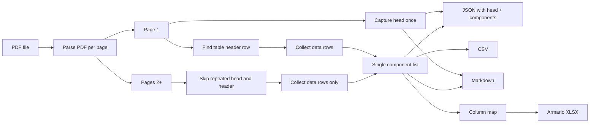

# Extract component list from armario PDF

## Context

- **Target PDF:** [docs/examples/armarios/pdf/PC307412_T14582100_O_LM.pdf](examples/armarios/pdf/PC307412_T14582100_O_LM.pdf). **Page 1:** head (metadata) then table header then component rows. **Pages 2+:** each page repeats a head and the table header; these repeats must be **ignored** — only the data rows from continuation pages are collected.
- **Existing armario format:** XLSX in `data/armarios/` with sheet `componentes`, header `['Codigo','Denominacion','PrecioUnitario','Cantidad','PrecioTotal']`, data from row 3 ([zenbat.config.js](../zenbat.config.js), [database.server.controller.js](../server/app/controllers/database.server.controller.js) `getArmario`).
- **No PDF handling** exists in the repo today; only XLSX is used for import.

## Approach

Use a Node script that:

1. **Reads the PDF** with a library that provides **positioned text** (x, y) so we can distinguish header vs body and align columns. Recommended: **pdf2json** or **pdfjs-dist** (Mozilla). Fallback: **pdf-parse** (text only) with line-based heuristics if the table is simple and column boundaries are clear from spacing.
2. **Detects structure (page-aware):**
   - **Page 1 only — Head:** capture everything before the table. Store as structured data and **include in the JSON output**. Do not capture head from later pages.
   - **Page 1 only — Table header:** identify the first table header row (e.g. by keyword matching or column count). Use this to define column layout for all pages. **Pages 2+:** skip the repeated head and repeated table header (same pattern at top of each page); treat those as continuation header blocks to ignore.
   - **Table body:** on every page, collect only **data rows** (after the header row on page 1, and after the repeated head + header on pages 2+). Append all data rows into a single component list.
3. **Output:**
   - **JSON:** one file (e.g. `{basename}.json`) with **head data and component list**, e.g. `{ "head": { ... }, "components": [ ... ] }` (head as object or array of lines; components as array of row objects).
   - **CSV:** component table only (e.g. `{basename}.csv`).
   - **Markdown:** one file (e.g. `{basename}.md`) with head section (formatted as text or key-value list) followed by the component table as a Markdown table (header row + rows).
   - **Armario XLSX:** (optional flag) map extracted columns to `Codigo`, `Denominacion`, `PrecioUnitario`, `Cantidad`, `PrecioTotal`, then use **xlsx** to write a workbook with sheet `componentes` and data from row 3, for use in `data/armarios/`.

## CLI tool: zenbat

Expose the extraction (and future commands) via a single CLI entry point.

- **Invocation:** `zenbat generate armario <input_file> -o <output>`
  - `<input_file>` — path to the armario PDF.
  - `-o, --output <path>` — output path: either a directory (write `{input_basename}.json`, `.csv`, `.md`, and optionally `.xlsx` there) or a basename (no extension) so files are written as `{output}.json`, `{output}.csv`, etc. in the current directory.
- **Design for extensibility:** use a subcommand-based CLI so more commands can be added later (e.g. `zenbat <command> [subcommand] [args]`). Recommended: **Commander** or **yargs** in the root package so that:
  - `zenbat` with no args (or `zenbat --help`) shows top-level help and list of commands.
  - `zenbat generate armario --help` shows options for this subcommand.
  - Adding e.g. `zenbat generate something-else` or `zenbat import ...` later is straightforward.
- **Implementation:**
  - **Bin entry:** in root [package.json](../package.json), add `"bin": { "zenbat": "./bin/zenbat" }` (or `./bin/zenbat.js` / `./bin/zenbat.mjs`). Ensure the file has a shebang (`#!/usr/bin/env node`) and is executable.
  - **CLI entry script** (e.g. `bin/zenbat` or `bin/zenbat.mjs`): parse argv with Commander/yargs; register `generate` as a command and `armario` as a subcommand (or `generate armario` as one command name); for `zenbat generate armario <input> -o <output>`, call the extraction logic (see below). Optional flags: `--xlsx` to also write the armario-format XLSX.
  - **Extraction logic:** can live in a module (e.g. `scripts/extract-armario-pdf.mjs` or `lib/generate-armario.js`) that exports a function `extractArmarioFromPdf(inputPath, outputBasenameOrDir, options)`. The CLI invokes this; no need to run a separate script by hand.

## Implementation steps

1. **Add dependencies (root package)**
   - PDF: e.g. `pdf2json` or `pdf-parse` (prefer one with text positions).
   - CLI: e.g. `commander` (or `yargs`) for subcommands.
2. **Create the zenbat CLI**
   - Add `bin/zenbat` (or `bin/zenbat.mjs`) with shebang; in root package.json add `"bin": { "zenbat": "./bin/zenbat" }`.
   - Wire `generate armario <input_file> -o <output>` (and `--xlsx`) via Commander/yargs; delegate to the extraction module.
3. **Create extraction module** (e.g. `scripts/extract-armario-pdf.mjs` or `lib/generate-armario.js`), callable from the CLI:
   - Input: PDF path; output: path (dir or basename); options: e.g. `{ xlsx: boolean }`.
   - Parse PDF (page-aware), capture head from page 1 only, skip repeated head/header on pages 2+, collect all data rows.
   - Column mapping config (e.g. `docs/examples/armarios/pdf/column-map.json`) for PDF column names → armario header.
   - Write `{output}.json` (head + components), `{output}.csv`, `{output}.md`, and if requested `{output}.xlsx` (armario format).
4. **Document usage**
   - In [docs/](index.md) or README: install (e.g. `npm link` or run via `node bin/zenbat`), then `zenbat generate armario <input_file> -o <output>` and optional `--xlsx`; note that table/header detection may need tuning per PDF.

## Tuning after first run

- If the PDF has a different header (e.g. "Code", "Designation", "Qty"), update the column mapping so that the script maps to `Codigo`, `Denominacion`, `Cantidad`, etc.
- If the "head" is large or has tables, you may need to make "start of table" configurable (e.g. "skip first N text blocks" or "first line containing X"). For pages 2+, if the repeated head/header height varies, make the "skip N lines at top of continuation pages" configurable.

## Optional later

- **Integration:** API route or "Import from PDF" in the armarios UI that uploads a PDF, runs the same extraction, and returns or saves the component list / XLSX.

## Diagram (high level)

